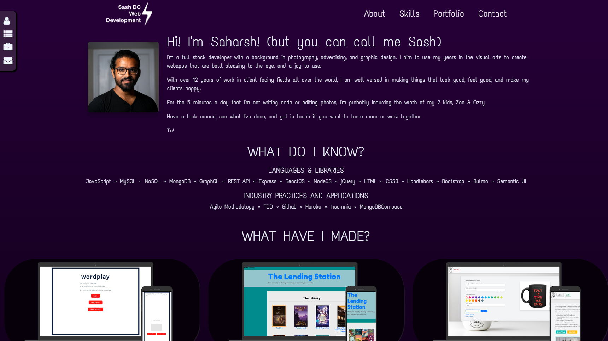

#  SashDC - WebDev Portfolio

## Overview

I have created a Portfolio website to market my skills, experience, and self. The page has links to previous work, contact details, and a recent headshot.

The page is designed to be responsive and adaptive to different viewports as well as with clickable links both internal and external.

### Links

 [Github Page](https://sashdc.github.io/sash-portfolio/)

 [Github Repo](https://github.com/sashdc/sash-portfolio)

 ## Credits

Cherian, Saharsh

[Creator Github](https://github.com/sashdc)

## License

N/A
    